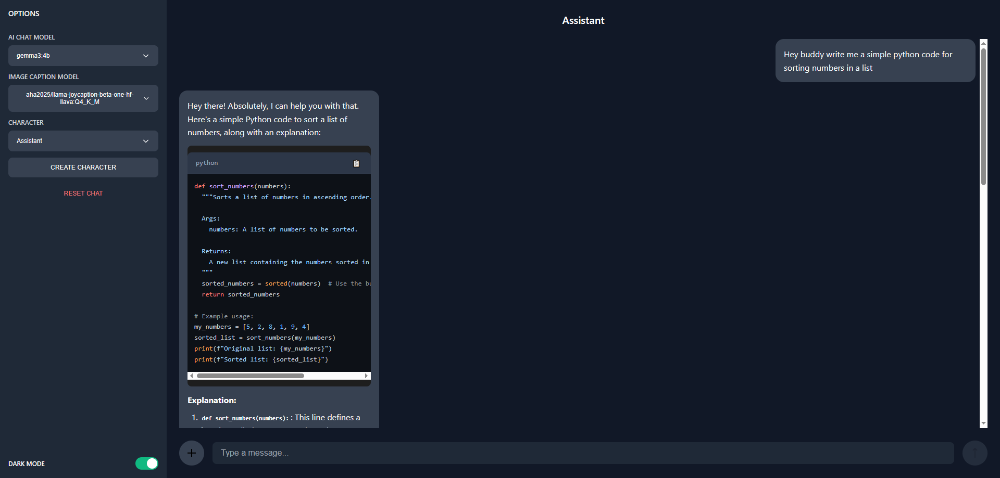
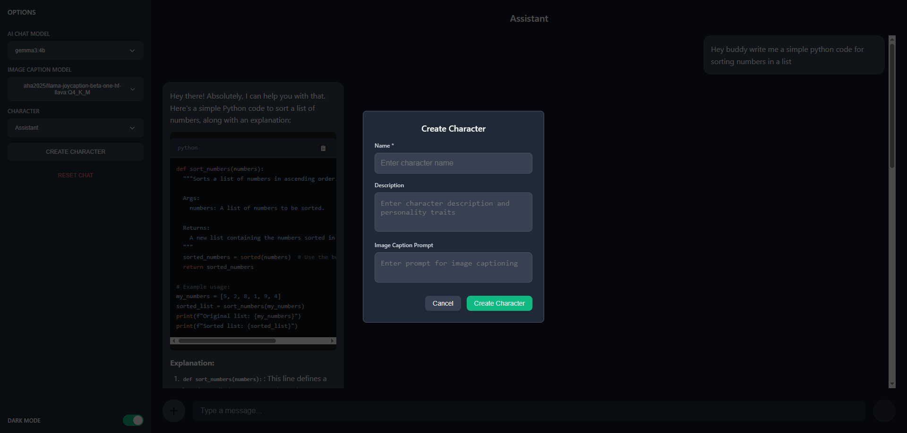

# Multi Model AI chat App

## Features
- Single Server Architecture - React and Flask served from one port
- Real-time Chat - Instant message display with typing indicators
- Multiple AI Models - Automatic discovery of chat and vision models
- Character Management - Create custom AI personalities
- Image Processing - Upload and analyze images with vision models
- Rich Text Rendering - Full markdown support with syntax highlighting
- Dark/Light Mode - Toggle between themes with persistence
- No Page Reloads - Smooth single-page application experience
- Copy Code Blocks - One-click code copying functionality

## Screenshots

## Recommended System Requirements
- 16GB RAM
- CUDA GPU 8GB VRAM

## Tech Stack Used:
- Flask
- React.js
- Tailwind CSS
- Ollama for LLM

## Models Recommended:
- Gemma3 4B
- Joycaption or BLIP for image captioning

## How to setup locally
- Step 1 install Ollama in your device [Ollama](https://ollama.com/download)
- Step 2 download LLM, use command `ollama run model_name` you can find [Models](https://ollama.com/search)
- Step 3 Download model for image captioning I recommend joycaption
- Step 4 `pip install -r requirements.txt`
- Step 5 `python app.py`